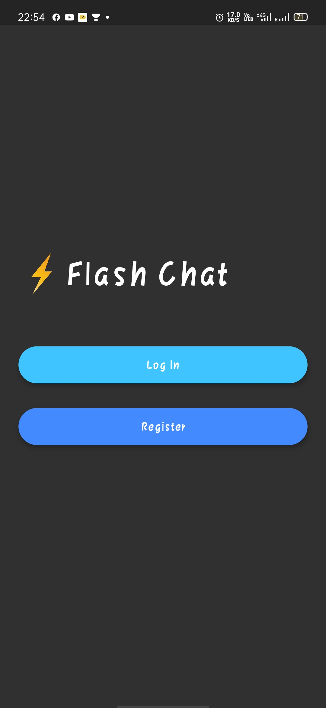
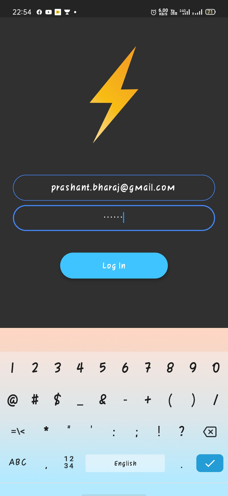
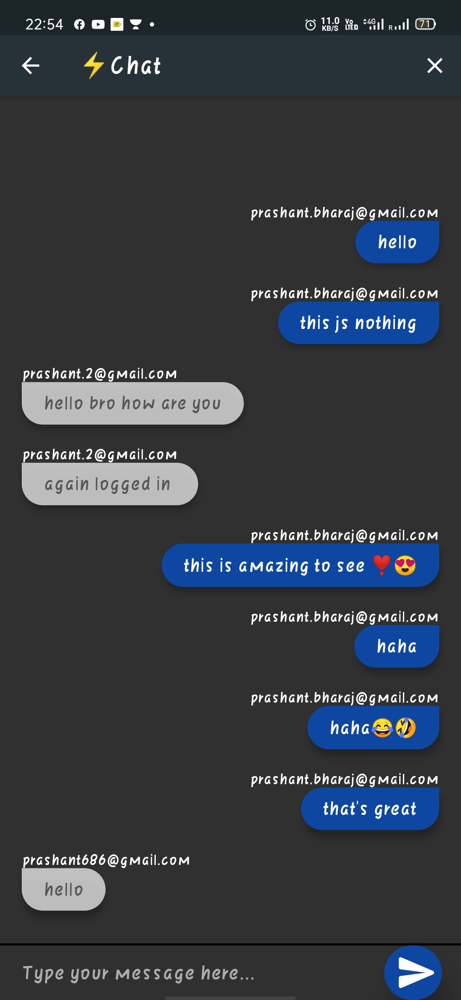
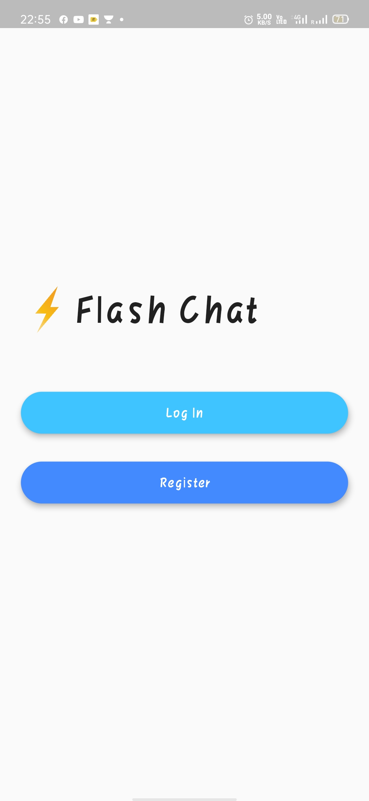
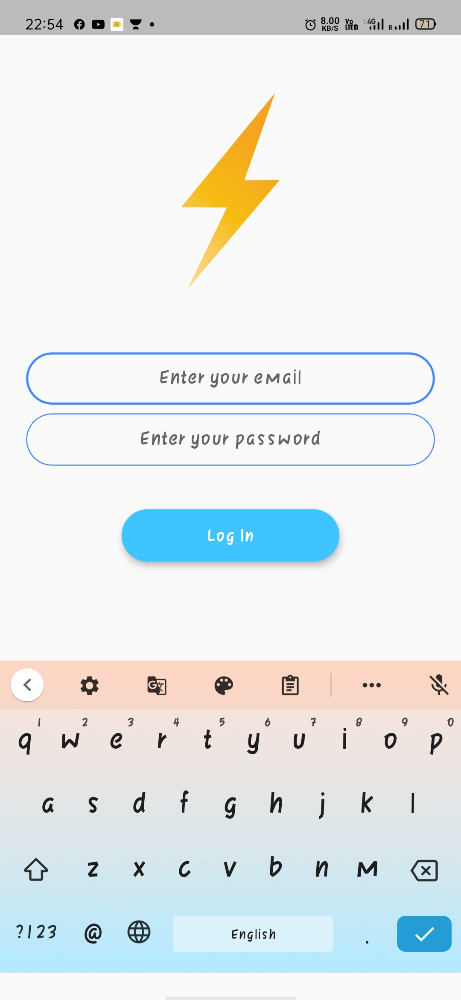
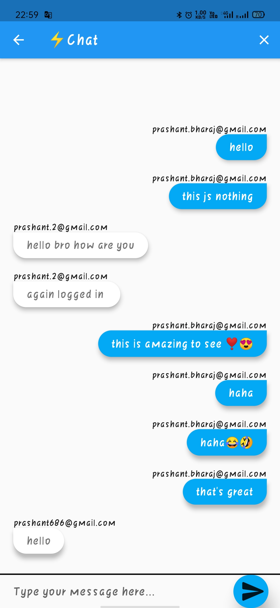

# flashchat

## What is the project?
It is a realtime chatting application. All the messages are stored on the cloud so user can login from different devices and access their messages.

## How it works?
* Use **Cloud-Firestore** for storing messages
* Use timestamp to organize the messages
* Use loggin credentials to display messages which are sent by the current user

-----
## Screenshots 

In Dark Mode 
&ensp;&ensp;
  In Normal Mode 
&ensp;&ensp;
-----

